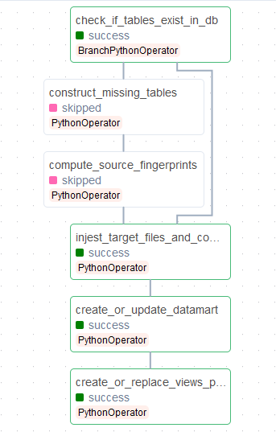
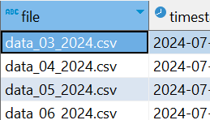
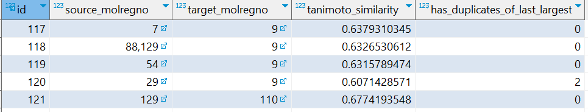
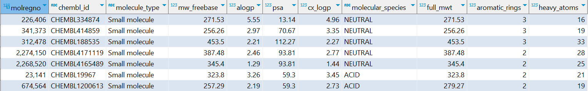
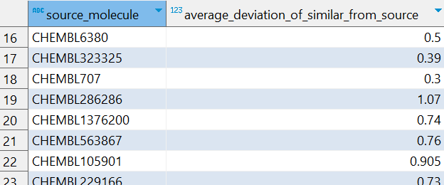

<h2>The Final Pipeline.</h2> 
Current structure: 

<h3>Installation notes:</h3> 
1. Set the following environment variables in <i><b>docker-compose.yml</i></b> file template in project dir:  
AWS_ACCESS_KEY_ID=key 
AWS_SECRET_ACCESS_KEY=key 
AWS_SESSION_TOKEN=token 
BUCKET_NAME=bucket_name 
DB_HOST=db_host 
DB_NAME=db_name 
DB_PASSWORD=db_password 
DB_PORT=port 
DB_USER=user 
S3_FOLDER_NAME=Output_folder1/.../folderN 
S3_INPUT_FOLDER=Input_folder/.../folder 
 
2. Check the files structure:
<b><i>/src</i></b> with all files within it should be in the <b><i>/dags</i></b> folder, and 
<b><i>final_pipeline.py</i></b> file should also be in <b><i>/dags</i></b> folder.
  
3. Run the command: 
 
<b><i>docker compose up --build</i></b>

<i>N.B.: Sometimes it is needed to set the permissions for /dags and /logs folders with 
<b><i>chmod -R 777 /folder</i></b> command.</i>

<h3>Pipeline workflow:</h3>

1. Pipeline should start with cron '0 0 1 * *' schedule and, upon triggering, the first branching task will check if the required tables exist in database:  
bronze_molecule_dictionary 
bronze_compound_properties 
bronze_compound_structures 
bronze_chembl_id_lookup 
 

If not, downstream task will attempt to download CHEMBL database, extract data from there 
and construct the bronze layer of the warehouse, followed by the task that computes morgan bit vectors 
for all source molecules and saves them in <b><i>fingerprints.csv</i></b> file in output S3 bucket folder.

I used 'bronze_' prefix because I haven't found a way to create subschema in postgres. 
Setting up the DB can take a while, from 1 to 3 hours depending on the system.  

2. When bronze layer is made and source morgan fingerprints computed, or when bronze tables initially present in DB,
downstream task reads input files from the input folder, saves file names in   
used_input_files 
 
table in DB for future use (if there are no new files in input folder, silver tables are not modified), computes morgan fingerprints, saves them to parquet files, loads them back, 
takes top 10, checks for duplicates and constructs datamart silver tables:  
silver_fact 

silver_dim_molecules 

 
3. Then the last task creates or replaces views in the DB:
 

 
 
<u>Note:</u>
in the input files there was one with [Na+] in SMILES. As a chemist, I took it into consideration, 'cause it's the salt of something and shouldn't be thrown away. 
Also while counting has_duplicates_of_last_largest_score flag I used not direct comparison of floats, but <i>np.isclose</i> 
method with tolerance 10E-9, 'cause direct comparison of floats can be tricky. The flag is an integer that shows exactly how many compounds in the set have that Tanimoto score with that target.  

Still working on it. 
My plans are:  
1. <del>write a dag that calls all the functions above (even now, if tables exist and there are no new input files, pipeline will not alter the data in DB)</del> 
2. add to that dag operators to create views, <b><i> - partly done</i></b> 
3. <del>move environment variables to docker_compose.yaml,</del> 
4. Add some notification like TG bot logger. 
5. Think on tests. Maybe integration ones. I tested modules manually, but who knows... 
6. clean the code. 

I hope that deploying the pipeline will be straightforward. At least I tried to make it so. 
 
<h3>Thank you!</h3>